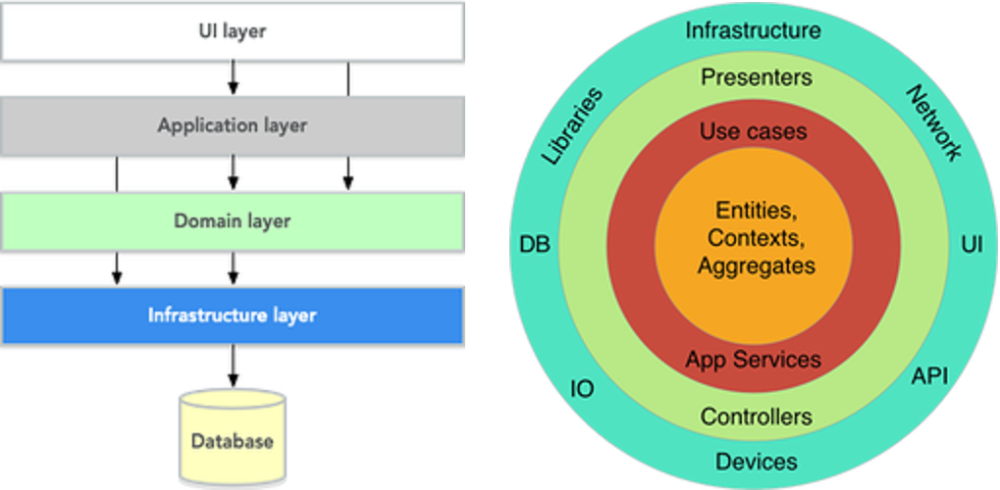

# Domain-Driven Design & Layered Architecture for Enterprise Salesforce Projects

## Introduction

While working on large Salesforce projects in large teams, I often encountered a lack of a consistent approach to
backend code organization. Although Trailhead and Apex Enterprise Patterns using the fflib library provide solid
guidance, they can feel too heavyweight for mid-sized or evolving projects where simplicity matters.

This motivated me to look for a more balanced solution. Discovering Domain-Driven Design (DDD) was a turning point.
Although Apex Enterprise Patterns and DDD have a lot in common, I found that DDD can be a strong alternative.

This repository is the result of that exploration and represents a DDD-inspired approach to structuring Apex code. It
provides two major benefits:

1) Immediate Practicality: Logical folder structures (such as domain/, application/, and infrastructure/) significantly
   improve code discoverability, making it faster to locate, understand, and modify logic—directly accelerating team
   workflows.

2) Long-Term Quality: The clear separation of concerns naturally encourages adherence to foundational software
   principles such as SOLID, DRY, and Separation of Concerns.

While introducing DDD adds some initial complexity, the approach pays off in enterprise environments by significantly
improving long-term code quality and streamlining development workflows for large teams.

## Overview

The project is organized following a layered architecture inspired by DDD principles. The fundamental rule is
unidirectional dependency: outer layers depend on inner layers, but not vice versa. This ensures the domain logic
remains pure and independent.

This repository contains a custom-built inbound REST API framework designed for the Salesforce platform. The framework
implements the Front Controller pattern to provide a unified entry point, dynamic request routing, centralized error
handling and logging, as well as a clear separation of concerns for processing external API requests.

The Data Transfer Object (DTO) is used in this project to establish a clean contract between Salesforce and external
systems. This abstraction decouples the internal Salesforce data model from the external API, allowing both sides to
evolve independently without breaking the integration. This is especially applicable in point-to-point integrations
(without middleware such as MuleSoft), where DTOs act as a lightweight anti-corruption layer.

## Brief Description of Domain-Driven Design (DDD) Layers

The Application Layer orchestrates specific use cases and user interactions. It acts as the intermediary between
external interfaces (like REST APIs) and the core business logic, coordinating workflows, and delegating tasks to the
domain layer. It contains application services and primary adapters (e.g., REST controllers) that initiate system
operations.

The Domain Layer is the heart of the system, containing the pure, use-case-independent business logic, rules, and
entities. It is the most stable and isolated part of the architecture, ensuring that core business concepts remain
unaffected by changes in external interfaces or technology choices. This layer defines the fundamental behavior of the
system.

The Infrastructure Layer provides the technical capabilities and concrete implementations that support the other layers.
It handles all interactions with external systems, such as database persistence (via SOQL), calls to third-party APIs,
and other platform-specific details. This layer plugs in the abstract domain and application models into the
real-world technical environment.

